### Decentralized KYC NFT Solution (Proof of concept)

***Abstract***

The **blockchain technology** that powers the **cryptocurrencies**
business is being hailed as a game-changing innovation that is *bringing
transparency to monetary transactions*. Despite some instability, the
**cryptocurrency** market has grown in value over the last two years.
And, according to financial experts, it will continue to be a rising
industry for the foreseeable future. **This steady increase has drew the
attention of authorities and lawmakers all across the world**. Because
this is a new industry, they are keeping a careful eye on how it
develops and functions. Regulators have put in place a number of
safeguards to ensure the industry's smooth growth and avoid any
unexpected hiccups. **KYC** (Know Your Customer) is one of these
methods. It refers to a financial institution's responsibility to
confirm a client's identity and conduct background checks before
enabling them to utilize a product or platform. It's part of a larger
package of **anti-money laundering** measures. Simply defined, it
prevents criminals from concealing the source of their illicit funds.
Financial institutions may ask their clients for information about their
investment knowledge, risk tolerance, personal details, and financial
situation as part of the **KYC** process. For **online financial service
providers**, this usually entails collecting a proof of address -- such
as a passport, driver's license, or national card id. Ideally, when you
fulfil the **KYC** requirements at a particular bank, *the other bank
still has no clue about who you are, and so they will be obliged to walk
you through their own **KYC** process* if for some reason, you decide to
access their services. To solve this redundancy and improve the user
experience while not sacrificing the privacy of the customers online. I
have engineered a **decentralized KYC** system that allows any **KYC**
issuer to register their customers on a public ledger in a very secure
way ---giving their customers the freedom to enjoy broader services from
various financial services providers while sharing minimal personal data
with them. The following report will walk you through the ups and downs
of building a decentralized solution that I had to market to one of the
most centralized and mysterious institutions in the world: **banks &
centralized exchanges**.

**Key Words**: KYC, Public Ledger, Ethereum, NFT, Blockchain,
Cryptography, privacy, data

***Dedication***

I dedicate this work to all the free spirits who believe in the **web3**
era which is already taking the world by storm. I dedicate this work to
all those who believe in decentralized finance and the power it has to
change the balances of power. I simply do dedicate all the toil and
sweat put into this work to everyone who believes the web should belong
to everyone.

**List of Acronyms**

::: acronym
**CCPA** - California Consumer Privacy Act 
**CSP** - Communication Service Provider 
**DApp** - Decentralized Application

**RPC** - Remote Procedure Call 
**NFT** - Non-fungible Token 
**DEFI** - Decentralized Finance 
**EVM** - Ethereum Virtual Machine 
**FCA** - Financial Conduct Authority 
**GDPR** - General Data Protection Regulation 
**IPFS** - Interplanetary File System 
**K8s** - Kubernetes
**KYC** - Know Your Customer 
**MVP** - Minimal Viable Product 
**POC** - Proof Of Concept 
**PAN** -Permanent Account Number
**SAAS** - Software As A Service

# General Introduction

KYC (Know Your Customer)is the basic procedure fulfilled by
online financial providers (banks, exchanges...etc) to verify their
consumers' identities and financial profiles. A customer is usually
required to provide a variety of verification data and documents online,
such as proof of name, address, marital status, and job. KYC forms are
used in the identification and verification process to assist businesses
and the government in tracking and preventing suspicious or potentially
dangerous behaviours such as fraud, bribery, and corruption. Because
I'm fully concerned about the archaic current KYC approach which
costs each bank millions of dollars annually, I was lucky enough to have the time to think about this for the couple last months. The proposed solution leverages the power of non-fungible
tokens -cryptographic assets on the blockchain with unique metadata that
distinguish them from each other- on the blockchain to protect ownership
of data, and easily verify any newly added customer by all parties. Our
decentralized approach proved to be efficient in lowering the expenses
for financial institutions' primary KYC verification procedures and
enhancing customers' satisfaction. Since, our main goal at the beginning
was to offer a solution where the fundamental KYC verification process
is only carried out once for each customer no matter how many financial
institutions he/she desires to cooperate with, . Customers can securely
communicate the outcome of the primary KYC verification with any
financial institutions they desire to do business with thanks to their
*Non-fungible token* that will be minted for them on the blockchain. In
the following chapters of this report, I'm going to walk you through our
journey from the brainstorming of the idea, the requirements analysis
and specification, the design choices of our system we had to make and
finally the implementation phase, where I will be addressing more in
detail the software architecture of our system and the underlying
technologies of our system. I'll be concluding with some final thoughts
on what were the encountered challenges, what could have been improved
and the key results of this journey.

## Requirements analysis

### Business requirements

The solution should:

1.  be easily integrated by developers

2.  be marketed to customers as a **Saas**

3.  be compliant with the business standards

### Architecture and Design requirements

### Non-functional requirements

#### Technical constraints

DeKYC will be accessible in **SAAS** mode. This mode of operation
imposes a certain number of constraints:

1.  Availability: The application must ensure the proper functioning of
    its service 7 days a week and 24 hours a day, that said the
    application must be able to process several requests at the same
    time without interference.

2.  Security: DeKYC must ensure protection against as many
    vulnerabilities as possible.

3.  The speed of processing: Indeed, given the large number of daily job
    transactions, it is absolutely necessary that the execution time of
    the processing approaches real time as much as possible.

4.  Integrity: The application must guarantee the security of access to
    the data of each user.

5.  Adaptability: Among the most necessary requirements, the application
    must understand and process several incoming data.

6.  User-friendliness: The application must be easy to use, it must
    offer simple, ergonomic interfaces adapted to the user.

#### Legal compliance

The first concerns to be raised is how we can handle  users private data and personal
documents. While it may sound challenging at first to be compliant with
international standards such as the **GDPR** in Europe or the **CCPA**
in the USA, it was easy for us to bypass those regulations and be fully
compliant with it. *For the sake of brevity I will be introducing the
GDPR and some of the questions we had to answer since the European
market was our first target*.

**What is GDPR?**

　　The purpose of the EU GDPR is to protect user's data and to prevent
large-scale online platforms or large enterprises from collecting or
using user's data without their permission. Violators will be punished
by the EU with up to 20 million Euros (equal to 700 million NT dollars)
or 4% of the worldwide annual revenue of the prior financial year. The
aim is to promote free movement of personal data within the European
Union, while maintaining adequate level of data protection. It is a
technology-neutral law, any type of technology which is for processing
personal data is applicable. So problem about whether the data on
blockchain fits GDPR regulation has been raised.

**How GDPR applies to blockchain ?**

　　First, it should be determined whether the data on the blockchain is
personal data protected by GDPR. Second, what is the relationship and
respective responsibilities of the data subject, data controller, and
data processor. According to Opinion 05/2014 on *Anonymization
Techniques* by Article 29 Data Protection Working Party of the European
Union, ***anonymization** is a technique applied to personal data in
order to achieve irreversible de-identification. And it also
said the "Hash function" of blockchain is a pseudonymization technology,
the personal data is possible to be re-identified. Therefore it is not
an "anonymization", the data on the blockchain may still be the personal
data stipulated by the GDPR. As the blockchain evolves, it will be
possible to develop technologies that are not regulated by GDPR, such as
part of the encryption process, which will be able to pass the court or
European data protection authorities requirement of anonymization. There
are also many compliance solutions which use technical in the industry,
such as avoiding transaction data stored directly on the chain.
Therefore, if data subject cannot be identified by the personal data on
the blockchain, that is an anonymous data, excluding the application of
GDPR.**In other words the GDPR applies only when data is not
anonymized!

**International data transmission?**

　　Furthermore, in accordance with Article 3 of the GDPR, \"This
regulation applies to the processing of personal data in the context of
the activities of an establishment of a controller or a processor in the
Union, regardless of whether the processing takes place in the Union or
not where the processing activities are related to: (a) the offering of
goods or services, irrespective of whether a payment of the data subject
is required, to such data subjects in the Union; or (b) the monitoring
of their behaviour as far as their behaviour takes place within the
Union".

## Existing Systems

### KILT

KILT  is a decentralized blockchain protocol for issuing
self-sovereign, anonymous, and verifiable credentials, enabling trust
market business models in Web 3, the next generation of the internet.
KILT's mission is to return control over personal data to its owner,
restoring privacy to the individual.

#### How does it work?

KILT enables an alternative. As a building block of the next generation
of the internet, KILT provides a new mechanism for handling user data,
enabling the issuance and holding of credentials digitally. An Attester
issues a credential at the request of a user (Claimer). The credential
describes certain attributes of the Claimer, which the Attester can
determine. The Attester sends the credential to the user who stores it
locally. This way the user gains full control over their credentials and
thus their data. KILT works like the credential process in the real
world, where trusted authorities issue documents which are then owned
and controlled by the individual. controlled by the people. A blockchain
identity protocol for issuing self-sovereign, anonymous, verifiable
credentials and decentralized identifiers

#### Handling personal data on KILT

KILT stores a checksum (hash) of this credential on the KILT Blockchain.
Blockchain technology enables the user to prove the authenticity of
their document to anyone they decide to show it to. KILT is built on
privacy by design principles, never storing any personal data on the
blockchain. The personal data is in the credential which is under
complete control of the user, while the blockchain only stores hash
values.

### Polkadex

Polkadex [@polkadex] is a decentralized KYC platfrom built on the KILT
blockchain it allows users to verify their identity while keeping their
personal data and documents private. This means that Polkadex (or any
other decentralized application you choose for proof of authentication)
never has access to your personal details as they always remain stored
in your wallet. It also means that you only go through the KYC process
once and then can just use your wallet for automatic verification on
multiple Web3 platforms that also use KILT Protocol. Cryptographic
magic!

#### Privacy of users

Essentially, the proof shows that an attester was verified, which means
they signed with their keys into the KILT blockchain. Polkadex verifies
whether the attester has attested or verified the credentials provided
by the user. This is how KILT verifies credentials without sharing the
actual data on the blockchain.

#### Decentralization

Polkadex users do not need to re-prove their credentials with Polkadex
(or any other future DApp that uses KILT Protocol for decentralized KYC,
for that matter) as the blockchain will show that Fractal has already
attested to the authenticity of their credentials.

### Limitations of current solutions

First, as we can already notice, the current solutions are built on a
specific blockchain which poses **interoperability challenges** and
limits the scope of what the users can do with their online digital
identity (*a non-fungible token stored on the blockchain in our case*).
Second, current solutions rely on identifying the user with a wallet,
which introduces a single point of failure where a digital wallet can be
stolen, and so anyone with the private key of that wallet can sign-up to
online services and use then underlying identity to benefit from the
premium services online.That's why we needed a solution that will live
on multiple blockchains and have a second layer of security which on top
of proving the ownership of a wallet (**a what you have**)a user will
still have to provide (a PIN code in our case).

To achieve that we have decided to use a *non-fungible token (NFT) that
will be linked to a user's **signature** online and be be moved
seamlessly cross chain*

## Proposed System

The proposed solution leverages the blockchain technology for all the
benefits it offers to build a decentralized solution that we will adopt as
 *DeKYC -for now- (see logo below). It is important to analyze why using
the blockchain is better than other potential technologies. First of
all, **the auditing and tracking are both improved by this approach
because of the immutable nature the blockchain**. This is beneficial for
the national regulator since it gives them a clear record of the data
that financial institutions confirm before opening the accounts or
allowing any transactions inside of their protocols (in case of
cryptocurrencies exchanges) and may act as a *single source of truth* in
the event of a disagreement. Second, this approach enables cooperation
between financial institutions that do not necessarily trust each
others.*

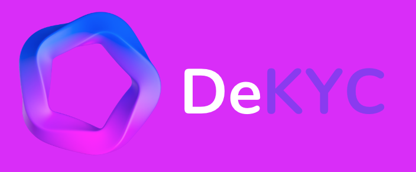

Our approach aims at making it possible for a **customer to only pass
the KYC once**, and then have his data available for the different
subscribing banks and online businesses (see figure 11).

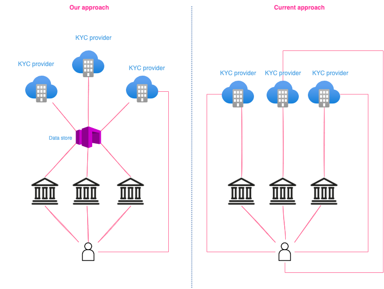

*DeKYC can be broken down into two parts, a part dealing with the
**user's identity** and the second on **the blockchain network** itself
on top of which the identity should live.*

### Functional Architecture

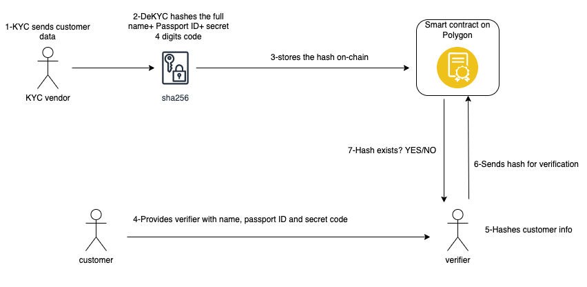

**On the KYC vendor side:**

1.  After a successful KYC, the user receives a 4 digit secret code that
    will allow him later to prove his identity to third party actors.

2.  The KYC issuer will mint a new NFT(Non-fungible token) -more details
    on how NFTs work will follow in this report- for the user by
    providing the hashed string of his full name, passport ID, and
    secret code into the metadata of the NFT.

Using the web3.js **one-way sha256 hash function** will result in
something like this:

**web3.utils.keccak256(\"SOUFIANEHAJAZIAA737450202\")=\"0x729f65beb\..."**

The hash will be then stored on-chain and would be callable through the
**tokenURI** function of our NFT.

Every NFT will have its own **URL** on IPFS, the **timestamp** (to make
sure that the KYC is still valid) and the **hashed** user data (referred
to as signature).

\
 \
**On the KYC NFT verifier side:**

1.  The customer submits his full name, his passport ID and the secret
    number on the third party's website.

2.  The data is then hashed and a call is sent to the smart contract to
    verify that the hash exists and whether the KYC is still valid or
    not (by checking the timestamp)

3.  If the hash exists on-chain and matches the token ID, the identity
    of the customer will be deemed valid by the verifier.

### A cross-chain identity

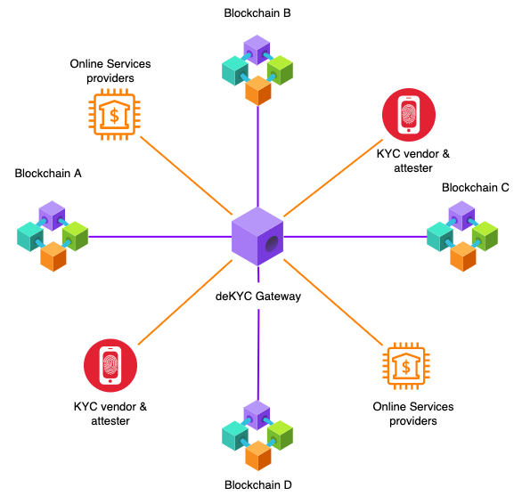

The second layer of our solution. Customers should be able to rely on
their NFT to prove their identity on different platforms in an easy and
simple way.

The two common authentication factors that we will be relying on to
authenticate users on third parties' platforms are:

**Something you have**: NFT (in your wallet)

**Something you know**: A randomly generated 4 digits number (PIN code)

In our case the proposed solution was to store users' hashed data in a
blockchain agnostic way, so that the user can freely move his
\"identity\" across multiple chains. The DeKYC gateway will allow users
to move their NFTs cross chain and allow issuers to easily identify on
which blockchain the user's identity is living. To achieve just that, we
relied on **2nd generation** blockchains which offers an application
layer where you can write your smart contracts in a Turing complete way.
The idea was to have a smart contract on the Ethereum platform that
stores all the valid customers who fulfilled the KYC process by a
recognized list of KYC vendors and make them easily verifiable by
everyone without giving up on the ownership and privacy of customers.

# Requirements specification

We will be tackling the project's software modeling by exposing the data
flow within our system, the involved actors(in our case online banks,
KYC vendors and consumers). Also we will be going through some of the
use cases depending on who is interacting with the system.

## Software modeling

### Use cases diagram

A use case diagram is the best tool to summarize the details of what
DeKYC is all about, since it allows us to easily understand the use
cases of our solutions and the different actors that would be involved.

#### Registering new customer by KYC vendor

When a customer fills in the KYC form online, the **KYC** vendor can
check first of all whether the user is already registered by another KYC
vendor, and see which type or category of KYC he falls in before going
any further with the procedure. If the customer is new to the network, a
digital signature would be generated and stored on the blockchain as an
NFT, minted immediately to the customer's *Ethereum wallet*[@wallet].

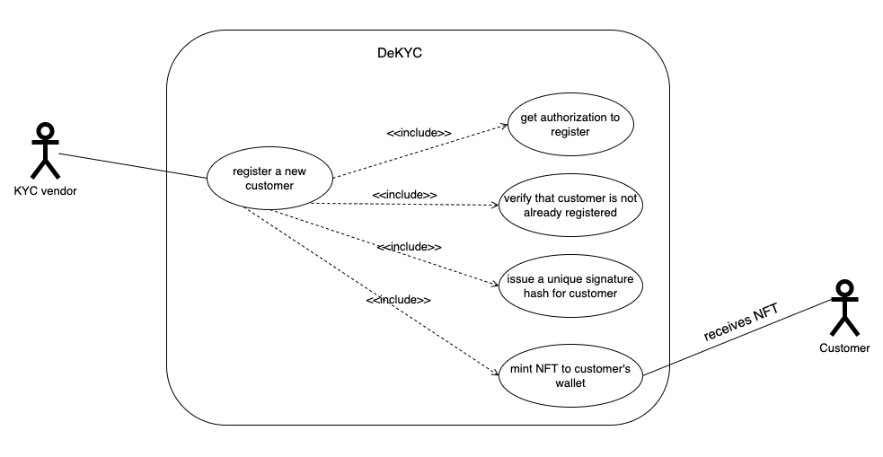

#### Verifying customer identity

An online service provider can request the PIN code, and basic personal
data from the users to generate a signature. The signature is later
verified by the online platform through **DeKYC**. If the signature
exists, it means that the customer was verified by one of the KYC
vendors. The platform can also get basic info regarding the KYC
procedure fulfilled by the customer( date, number of verified documents,
AML checks, risk rating\...) but not personal data like name, address
and country of residence.

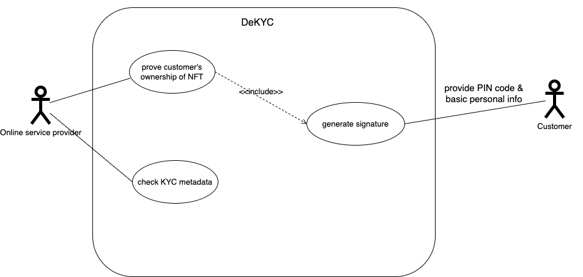

#### Customers interaction with DeKYC

The customers can also directly interact with DeKYC through its API, if
needed to restore a PIN code or change the underlying wallet that stores
the hashed signature.

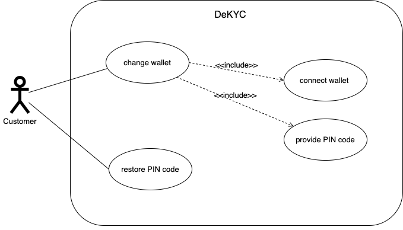

### Data flow diagram

A data flow diagram shows how data moves through an information system
graphically. It may show the flow of stored data as well as incoming and
outgoing data. Below is our Level 1 DFD which depicts basic modules in
the system and flow of data among our modules.

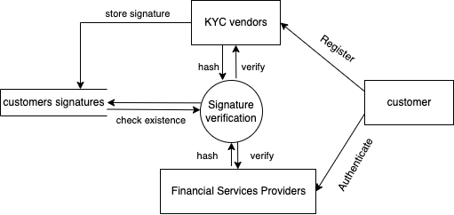

# Software design

This chapter will present an overview on the general design choices of
the proposed solution, the sequence diagrams, and the general class
diagram.

## Architecture of the decentralized KYC solution

The solution stores users signatures on-chain and all necessary KYC
files on **IPFS**. A **relayer** [@relayer] allows the
*bridging*[@bridge] of **KYC NFTs** cross-chains, allowing users to
enjoy the limitless services offered by different protocols built on
different blockchains.

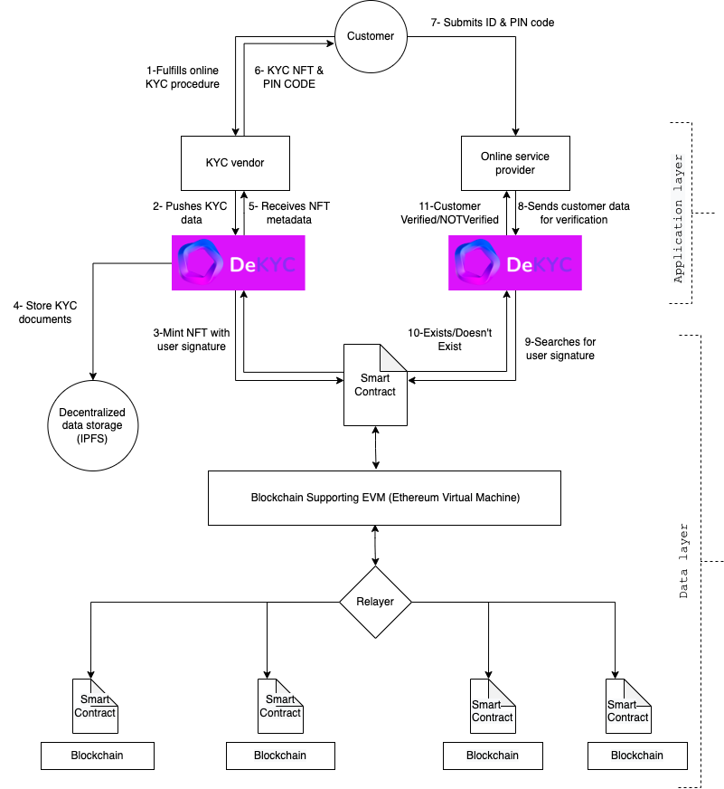

## Sequence diagrams

### Issuing a new identity on-chain

Adding a new customer to the DeKYC protocol, follows the sequence below.
After a KYC vendor validates the identity of the user, it sends a mint
order to our REST API by calling the **registerCustomer** controller
which hashes the user data and stores the signature in the smart
contract deployed on the **Polygon** sidechain. A non-fungible token is
then minted to the customer's wallet address.

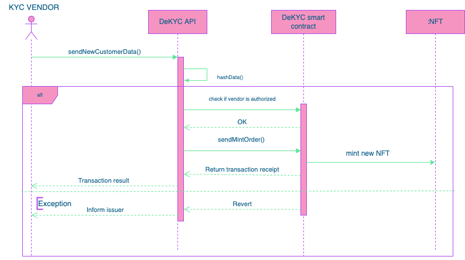

### Customers authentication with DeKYC

The online financial services provider (**verifier**) submits the form
data filled by the customer. Only a portion of that data is communicated
with **DeKYC API**, where it will be hashed and tested against the
stored values on the DeKYC smart contract. If the generated signature
corresponds to one of the NFTs, the metadata related to it will be sent
in response to the **verifier**.

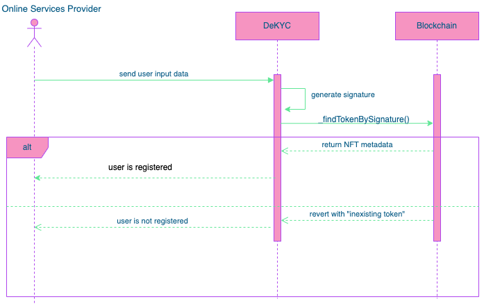

## System class diagram

The following class diagram is used to model the objects that make up
our system, to display the relationships between the objects, and to
describe what those objects do and the services that they provide. It
was proven to be very useful in many stages of our **design branch**.
*Note here that the bank can act as a verifier and attester at teh same
time in case it conducts an offline KYC. A bank can always vouch for a
new customer and share it with the KYC providers*.

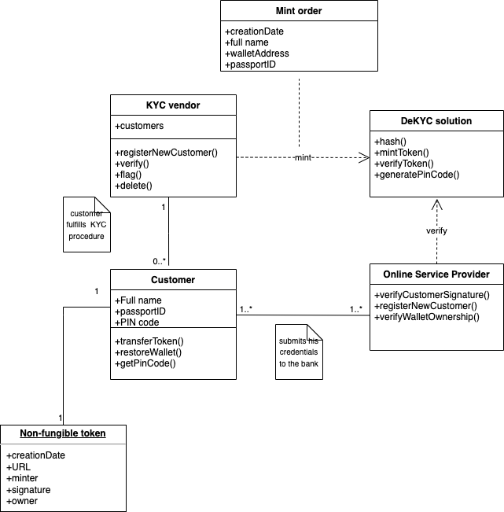

# Development

After the requirements specification and analysis and design phases,
this chapter presents what has been done in terms of technological
choices and code. We will also present screens that illustrate the
implementation of the solution.

## Software architecture

### General system architecture

The whole system architecture can be broken into **5** main components
which comprise:

-   **A front-end (dashboard)**: for all necessary analytics
    visualization and admin actions

-   **Indexer**: to index data on the blockchain ( used **The Graph**)

-   **A Web3/Node provider**: to interact with the blockchain network

-   **A RESTful API**: to interact with the blockchain in a seamless and
    easy way.

-   **A smart contract**: to execute and store all the protocol logic
    and data (only recent data not historic data, that's where **the
    indexer** comes in)

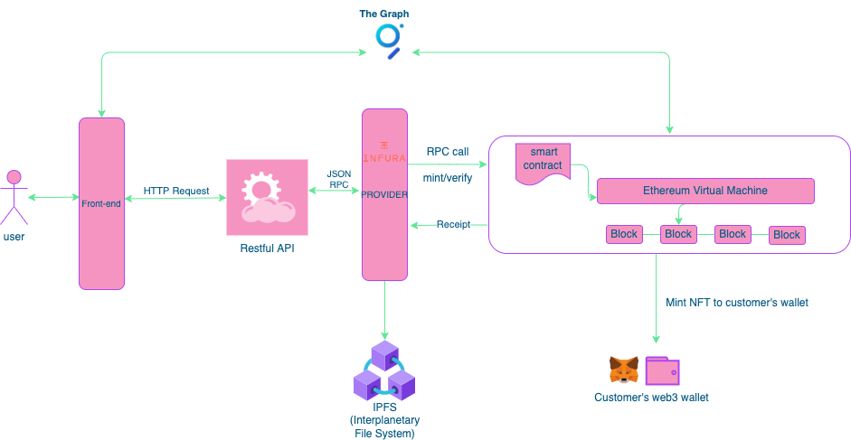

### DeKYC REST API

To make building the solution easier, DeKYC wraps all interactions with
the blockchain in a REST API. Every interaction, from minting to
verifying a signature on-chain, is as simple as an API call. Converting
complex asynchronous blockchain interactions, which can take minutes or
hours, into synchronous REST API calls, is a powerful upgrade to
existing blockchain development paradigms. Without the need to interact
directly with smart contracts, service providers, such as established
banks and kyc vendors can easily onboard the solutions to what they
already have. The diagram below shows how KYC vendors interact with the
API to push a new customer.

**Swagger**, a software tool for designing, creating, documenting, and
using RESTful APIs, was used to document the API. It adheres to the
**OpenAPI** standard. This is a specification for constructing RESTful
API interfaces for describing, producing, consuming, and visualizing
them.

To have an overview on the class diagram of our DeKYC API we have used a
Java library (*openapi-to-plantuml*) to generate a **PlantUML** Class
Diagram from the **OpenAPI 3.0** definition of our **Swagger YAML file**

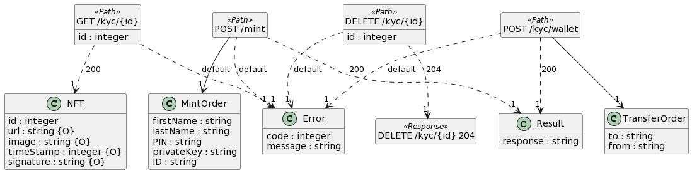

#### Jobs and queue management

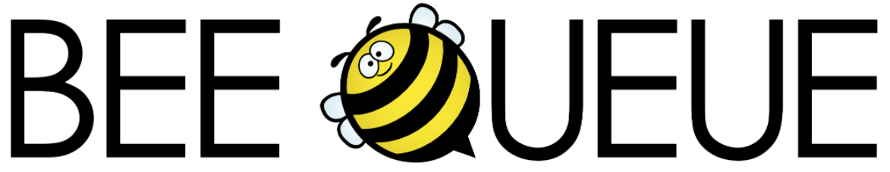

I used the Node.js library **Bee-queue** which is a simple,
fast, robust job/task queue for Node.js, backed by Redis.

#### Caching strategy

**Pin code generation**\
To generate the pin code we have relied on a **NPM** package
\"Secure-Pin\" that uses a cryptographically secure method of generating
pins, ensuring a high amount of entropy.

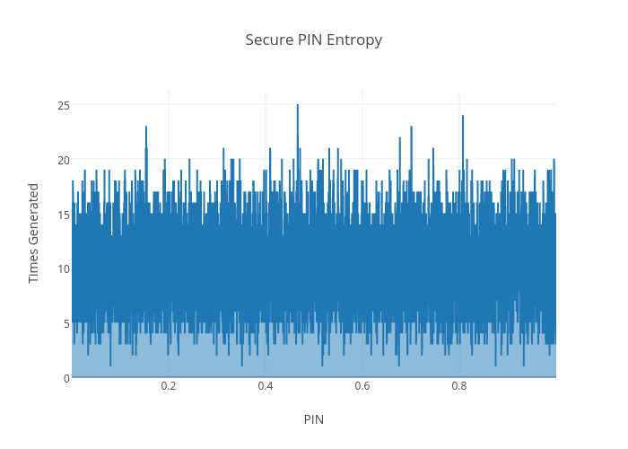

Above is a graph of 100,000 randomly generated 4 Digit PINs, with an
even distribution across the graph.

The X-Axis represents the PIN number/1000.0f, the Y-Axis represents the
amount of times the PIN was generated during the 100,000 cycle.

### DeKYC Smart Contract

At the core of our solution, there is a smart contract which stores all
our KYC NFTs data. The smart contract was deployed on the **Polygon
sidechain**. It has an admin user (defined by a wallet address) which
later can define more roles, and whitelist new KYC vendors to mint new
NFTs to customers on the network.

The smart contract allows us to:

-   add/remove new KYC vendor

-   verify user checksum

-   store all users KYC metadata

-   mint new **NFTs** for customers

-   keep track of all KYC vendors data

-   manage access control

The contracts are written in **Solidity** (native language of smart
contracts on EVM) which supports **inheritance** between smart
contracts, where multiple contracts can be inherited into a single
contract. Below is the UML class diagram of our smart contracts. Note
that the main contract is **KYC** which has its own interface **IKYC**,
and inherits from **ERC721Enumerable** (enhanced ERC721 contract) and
**ownable** (for admin role and access control).

Smart contracts are **immutable** by nature. Thus, updating and fixing
source code in order to create iterative releases has a significant
impact on the quality of software. A certain amount of mutability is
still required for bug fixes and possible product upgrades, even if
blockchain-based software benefits greatly from the technology's
immutability. The solution was to ensure **upgradeability** of the
contracts using a **Proxy Pattern** as depicted below:

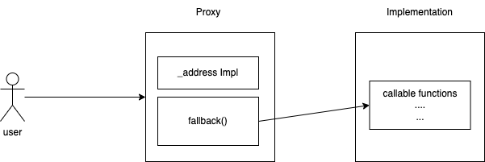

Users engage directly with the **proxy** which serves as a
straightforward wrapper or as it is responsible for transmitting
transactions to and from the second contract, which houses the logic.
The crucial idea to grasp is that, unlike the proxy or access point, the
logic contract may be altered.

### DeKYC Dashboard

The **dashboard** offers two views. One for the **admin** and the second
for the **KYC vendors** where they can sign in to their private space
and have access the basic services listed below (by role):

-   For admin: keep track of all NFTs minted by KYC vendors, number of
    requests made to the API, and overall view on verified customers.

-   For KYC vendors: overview of the total spent on NFTs minting, the
    average fee, the number of active customers\...etc

::: center
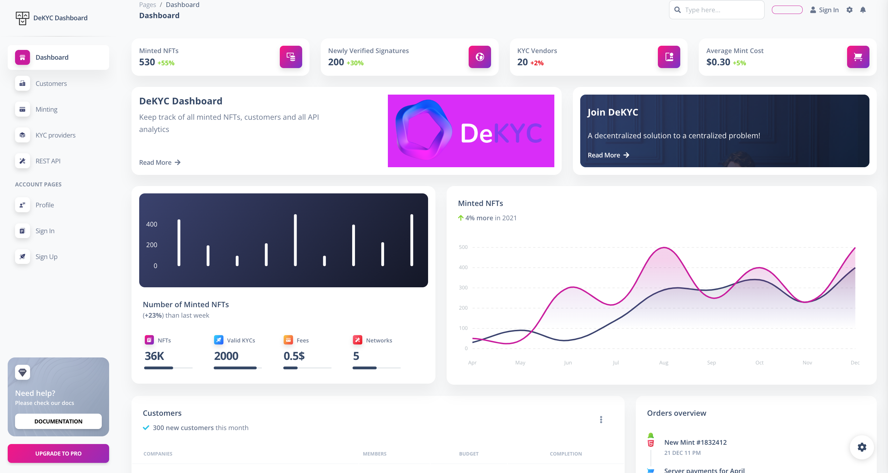
:::

### DeKYC NFT Gateway(under development)

The **DeKYC gateway** is responsible for tracking all transfers of NFT
cross multiple chains. The main function fulfilled by the gateway is to
locate the token and return its network id.

The gateway relies on a **subgraph** that subscribes to all events
logged by the contract deployed on Polygon.

### Kubernetes cluster

#### Why use K8s?

**Kubernetes** takes care of scaling and manages failover for your
application, provides deployment patterns, and more.

All in all working with Kubernetes offered us the following:

## Final thoughts

Working with web3 technologies wasn't void of challenges and heated
discussions. But whether it is a web2 or a web3 technology each poses
its own challenges. Here are some of the points that either went
suspended or delayed because of security concerns:

### Storing users personal documents on IPFS

When a KYC vendor registers a new user, usually the scanned ID card of
the user ends up in a private server owned by the KYC vendor, which
makes the question of availability of these documents to everyone in the
network a very challenging idea to implement. Our approach to this
question from the beginning was to include IPFS (Interplanetary File
Storage) a P2P network for file storage in our DeKYC solution for KYC
vendors to use when pushing a new customer. However, since every file on
IPFS is identified with a unique hash that is used later to retrieve the
file and serve it through a public gateway, the problem of storing all
those files on IPFS poses some security concerns. First, a file cannot
be \"deleted\" on IPFS and secondly anyone in the world with the hash
can see view the file with all your scanned IDs. Also, storing personal
data in a decentralized network like IPFS was against the guidelines of
**GDPR**. Two different solutions were suggested for this matter:

-   store IPFS files hashes in the smart contract: every data in the
    smart contract is public so anyone can retrieve the files hashes and
    download the customers ID cards from IPFS.

-   store hashes in a centralized database and make them available for
    network participants. Although it might sound like the best
    solution, it introduces a single point of failure and makes the
    system less decentralized.

-   use private IPFS nodes to store sensitive files and only allow
    access to certain participants (currently researching this solution)

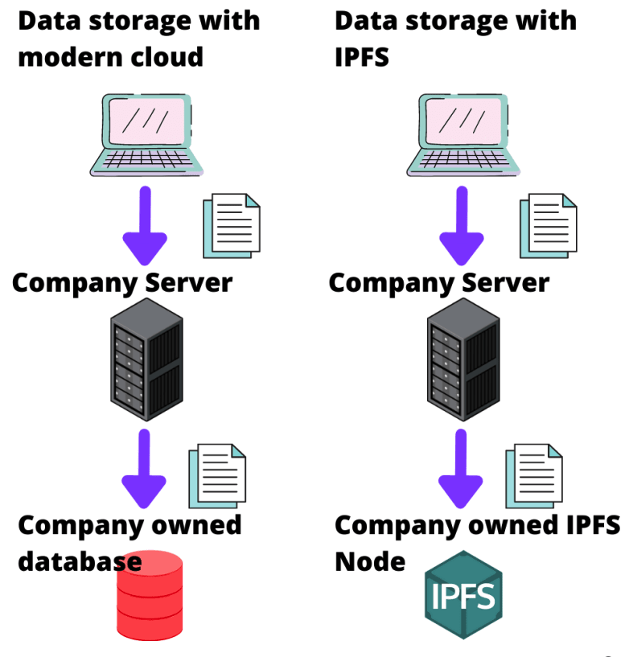

We are currently looking into different ways we can make scanned IDs
verifiable by any participants in a secure way. The purpose is to reduce
the friction of submitting your ID each time you sign up to an online
service provider.

### A serverless architecture?

We were also very tempted by going with a serverless architecture using
the **Lambda function** by AWS because of the automatic scaling, reduced
software complexity, quick deployment and the lower costs it offers. But
still, some points like **security** and **privacy** had to be seriously
considered since we are handling very sensitive data.

### Transferrable Non-fungible tokens?

When minting a new KYC badge to a wallet address, the question of
whether the user should be given the freedom to transfer his NFT to
different wallets, a thing that will allow the user to **\"lend\"**
their identity to others to benefit from a service even when they are
not allowed to do so. Security was a serious matter and that's why we
have introduced a **\"whitelisting\"** mechanism that allows users to
only transfer their KYC tokens to verified addresses.

### Cold or hot storage?

Since each service provider participating in the network (pushing new
customers or validating) needed to sign the transaction with their
Ethereum wallet private key, there has been a security risk about the
handling of private keys since day one. Choosing between a hot wallet
(connected to the internet) for faster and easier transactions and a
cold wallet (not linked to the internet) for greater security but less
convenience was a bottleneck. But the most secure scenario at the end
was to let the participants have full custody over their wallet. And
only provide their private key when a transaction is needed to be
signed.

# Conclusion

In our decentralized approach, we sought to identify the core issues
that traditional KYC processes face, as well as how we can leverage the
blockchain technology to revolutionize the entire identity ecosystem
online and return privacy control to end-users or end-customers, who
will use DeKYC as a decentralized, transparent, and trust-based online
identity solution. We were also able to deliver a proof of concept and
MVP to our customers. It's true our solution couldn't solve all the
problems that the institutions and online services provider encounter in
the digital space. Some of the open topics for research and improvement
are fraud prevention utilizing artificial intelligence, defining the
devices' identification, decentralized Apps application models,
on-chain/off-chain oracles, performance, and the design for
decentralized score-based KYC.

::: Bibliography

<https://www.europarl.europa.eu/RegData/etudes/STUD/2019/634445/EPRS_STU(2019)634445_EN.pdf>

<https://www.blockchain-council.org/blockchain/solana-vs-polygon-vs-ethereum>

<https://iaria.org/conferences2019/filesICSNC19/SyedAsharHussain_ZeeshanUlHassanUsmani_DKYC.pdf>

[https://www.thinkmind.org/articles/icsnc_2019_4\_30_28005.pdf ](https://www.thinkmind.org/articles/icsnc_2019_4_30_28005.pdf )

Kevin Rutter, \"first succeed decentralized\", R3, 2018

<https://docs.kilt.io/docs/concepts/what-is-kilt>

https://sumsub.com/knowledgebase/

<https://layerzero.network/pdf/LayerZero_Whitepaper_Release.pdf>

<https://docs.polkadex.trade/orderbookDecentralizedKYC/>

[https://plantuml.com/class-diagram ](https://plantuml.com/class-diagram )

<https://www.investopedia.com/terms/k/knowyourclient.asp> [
https://blog.liquid.com/blockchain-cross-chain-bridge](
https://blog.liquid.com/blockchain-cross-chain-bridge)

[
https://ethereum.org/en/wallets/](
https://ethereum.org/en/wallets/)
:::

# Storing KYC documents on IPFS

In order to achieve maximum decentralization when storing the KYC
documents on IPFS, an open source solution for IPFS storage I've previously worked
on during a previous internship could be adopted. The API allows anyone to push a file
on IPFS and store its ahsh on a smart contract in the **Ethereum
blockchain**. It's also worth mentioning here, that *the hashes of the
files are not stored on a publicly known smart contract) since every
data on the smart contract is public even when variables are declared
internal or private*.

Here is in a nutshell how the IPFS API works:

-   The user pushes the file to the API endpoint

-   The file is then pushed to IPFS and has a unique content identifier
    called (CID)

-   The unique hash is then stored on the smart contract as well as
    other metadata (owner, timestamp, title, description of content..)

-   The user can now retrieve the file from the smart contract by
    providing the title of the requested file to the API endpoint.

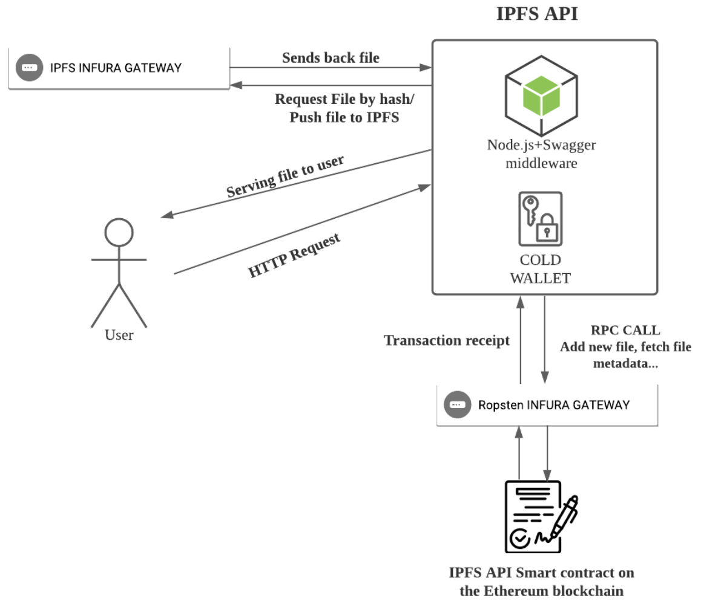

